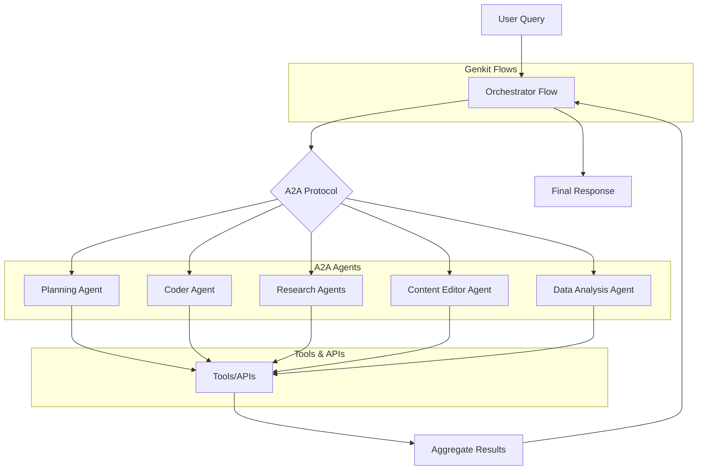

# AGENTS.md

This file is a machine- and agent-oriented guide for contributors and automated coding agents working on Genkit-UI. It focuses on actionable commands, architecture, and operational details agents need to inspect, test, and modify the codebase.

## Project Overview

Genkit-UI is a TypeScript multi-agent system built on Google Genkit and the A2A (Agent-to-Agent) protocol for complex tasks like research, code generation, and content creation.

### Architecture

The system orchestrates specialized agents through Genkit flows and A2A communication:

- **Genkit Flows** ([src/flows](src/flows)): High-level orchestrations with Zod schemas for input/output validation.
- **A2A Agents** ([src/agents](src/agents)): Independent Express services exposing AgentCards and executing tasks.
- **Tools** ([src/tools](src/tools)): Reusable Genkit tools (e.g., calculator, weather, Wikipedia) callable by flows/agents.
- **Shared Interfaces** ([src/agents/shared/interfaces.ts](src/agents/shared/interfaces.ts)): Typed contracts for A2A and orchestration.
- **Config** ([src/config.ts](src/config.ts)): Central Genkit `ai` instance with Gemini 2.5 Flash model.
- **MCP** ([src/mcp](src/mcp)): Model Context Protocol utilities for tool registry and context propagation.

### Data Flow

Key technologies: TypeScript ^5.9.2, Genkit ^1.20.0, @a2a-js/sdk ^0.3.4, Zod ^4.1.11, Express ^4.21.2, Vitest ^3.2.4.

## Setup Commands

- Install dependencies: `npm install`
- Set environment variables: GEMINI_API_KEY required (mandatory), optionally SERPAPI_API_KEY, NEWSAPI_API_KEY, VECTORSTORE_INDEX.
- Verify setup: `npm run genkit:ui` (starts dev UI for flows/tools).

## Development Workflow

- Start Genkit UI (flows/tools testing): `npm run genkit:ui` – watches `src/index.ts`, serves at localhost:3000.
- Start local flow server (HTTP): `npm run flow:serve` (port: env FLOW_PORT or 3400).
- Start individual agent servers: e.g. `npm run agents:orchestrator` (port 41243), `npm run agents:planning` (41244), `npm run agents:academic` (41245), `npm run agents:news` (41246), `npm run agents:data-analysis` (41247), `npm run agents:coder` (41242), `npm run agents:content-editor` (10003), `npm run agents:web-research` (41248).
- Interact with agents: `npm run a2a:cli http://localhost:41243` (example for orchestrator) – streams messages, handles tasks/sessions.
- Hot reload: tsx watches TS files; restart agents for prompt/config changes.
- Debug: Enable `thinkingConfig.showThoughts: true` in `src/config.ts` for Gemini traces; use Genkit UI for flow visualization.

## Testing Instructions

- Local mocking conventions: Use `vi.mock` to mock Genkit `ai`, A2A eventBus, external APIs (wikipedia, weather).
- Add tests: For new code, add to `__tests__/` with describe/it/expect; mock dependencies to isolate units.

## Code Style Guidelines

- TypeScript: Strict mode (`tsconfig.json`); use interfaces for A2A types (`src/agents/shared/interfaces.ts`). Async/await over promises; type all functions.
- Genkit patterns: `ai.defineFlow`/`ai.defineTool` with Zod schemas (inputSchema/outputSchema); import `ai` from `../config.js`.
- A2A agents: `index.ts` sets up Express + A2AExpressApp; implement AgentExecutor with execute(requestContext, eventBus); publish Task/Status events.
- Naming: camelCase for vars/functions, PascalCase for classes/interfaces. Prompts in .prompt files next to agents.
- Imports: Relative for local (`../config`), absolute for node_modules. No unused imports (ESLint).
- Error handling: Try-catch in executors; throw descriptive errors in tools; publish failed status.
- Linting/Formatting: ESLint (`eslint.config.js`) for TS rules; Prettier (`prettier.config.js`) for formatting. Run `npm run lint -- --fix` before commit.

## Build and Deployment

- No build step: Direct TS execution via tsx (npm scripts use tsx `src/...`).
- Production: Set `NODE_ENV=production`; use PM2/forever for agent servers. Docker: Use `docker-compose.yaml` for multi-agent stack (env vars injected).
- Firebase App Hosting: For serverless deployment, use `firebase deploy --only hosting:apphosting` to deploy the backend (genkit-backend). Adapts agents/flows as callable endpoints (e.g., /orchestrator). Set secrets with `firebase functions:secrets:set GEMINI_API_KEY`. Local test: `firebase emulators:start --only functions,hosting`. See `firebase.json` for config.
- CI/CD: GitHub Actions (`.github/workflows/`); run tests/lint on PRs. For agents, test A2A endpoints with mocks.

## Security Considerations

- API Keys: Never commit keys; use `.env` (gitignore'd). Agents check `GEMINI_API_KEY` at startup.
- A2A: Localhost by default; add auth (securitySchemes in AgentCard) for production. Validate inputs to prevent injection in prompts/tools.
- Tools: Wikipedia public but rate-limit; weather mock—use secure API in prod. No user data persistence.

## Pull Request Guidelines

- Title format: `[agent/flow/tool] Short description` (e.g., `[orchestrator-agent] Improve task delegation`).
- Required checks: `npm test`, `npm run lint` (if configured in CI). Fix type and lint errors before merging.
- When changing prompts or schemas, include a small unit test that verifies behavior or adds examples to `src/flows`.
- For agent or A2A changes, include updates to the relevant AgentCard and add integration tests for A2A message flows if possible.

## Debugging and Troubleshooting

- Agent won't start: verify `GEMINI_API_KEY` and `PORT` overrides.
- Flow not registered in UI: ensure `src/index.ts` exports the flow and restart the Genkit UI/FlowServer.
- Mismatched Zod schemas: update flows and add tests; most flows validate input using Zod at runtime.

## File map (reference)

### Core (`src/`)

| File/Folder | Type | Description |
|-------------|------|-------------|
| [cli.ts](src/cli.ts) | TypeScript | CLI for interacting with A2A agents and flows. |
| [config.ts](src/config.ts) | TypeScript | Central Genkit `ai` instance configuration with Gemini model and plugins. |
| [flowServer.ts](src/flowServer.ts) | TypeScript | Lightweight HTTP server to expose flows over HTTP. |
| [index.ts](src/index.ts) | TypeScript | Entry point for Genkit flows (exports flows for Genkit UI). |
| [agents/](src/agents/) | Directory | A2A agents directory. |
| [errors/](src/errors/) | Directory | Error handling utilities. |
| [evaluators/](src/evaluators/) | Directory | Evaluation tools for code quality. |
| [flows/](src/flows/) | Directory | Genkit flows directory. |
| [mcp/](src/mcp/) | Directory | Model Context Protocol utilities. |
| [prompts/](src/prompts/) | Directory | Dotprompt files for agents and flows. |
| [schemas/](src/schemas/) | Directory | Zod schemas for validation. |
| [tools/](src/tools/) | Directory | Genkit tools directory. |

### Agents (`src/agents/`)

| File/Folder | Type | Description |
|-------------|------|-------------|
| [academic-research-agent/](src/agents/academic-research-agent/) | Directory | Academic research agent with search utilities and Genkit integration. |
| [coder/](src/agents/coder/) | Directory | Code generation agent with artifact streaming and format parsing. |
| [content-editor/](src/agents/content-editor/) | Directory | Content editing agent for proofreading and polishing text. |
| [data-analysis-agent/](src/agents/data-analysis-agent/) | Directory | Statistical analysis agent with JSON-structured outputs and fallback simulation. |
| [news-research-agent/](src/agents/news-research-agent/) | Directory | News research agent with search tools and prompt-based analysis. |
| [orchestrator-agent/](src/agents/orchestrator-agent/) | Directory | Central orchestrator for task delegation, synthesis, and quality validation. |
| [planning-agent/](src/agents/planning-agent/) | Directory | Planning agent for query decomposition, risk assessment, and methodology selection. |
| [shared/](src/agents/shared/) | Directory | Cross-agent types, interfaces, and shared utilities. |
| [web-research-agent/](src/agents/web-research-agent/) | Directory | Web research agent with search capabilities and result aggregation. |
| [README.md](src/agents/README.md) | Markdown | Overview of agents directory and development notes. |

### Flows (`src/flows/`)

| File | Type | Description |
|------|------|-------------|
| [academicResearchFlow.ts](src/flows/academicResearchFlow.ts) | TypeScript | Flow for academic research orchestration. |
| [coderEvalFlow.ts](src/flows/coderEvalFlow.ts) | TypeScript | Flow for code evaluation. |
| [coderStreamingFlow.ts](src/flows/coderStreamingFlow.ts) | TypeScript | Streaming flow for code generation. |
| [contentEditorFlow.ts](src/flows/contentEditorFlow.ts) | TypeScript | Flow for content editing. |
| [dataAnalysisFlow.ts](src/flows/dataAnalysisFlow.ts) | TypeScript | Flow for data analysis. |
| [indexDocumentsFlow.ts](src/flows/indexDocumentsFlow.ts) | TypeScript | Flow for indexing documents. |
| [interruptDemoFlow.ts](src/flows/interruptDemoFlow.ts) | TypeScript | Demo flow for interrupts. |
| [newsResearchFlow.ts](src/flows/newsResearchFlow.ts) | TypeScript | Flow for news research. |
| [orchestratorFlow.ts](src/flows/orchestratorFlow.ts) | TypeScript | Top-level orchestration flow. |
| [orchestratorStreamingFlow.ts](src/flows/orchestratorStreamingFlow.ts) | TypeScript | Streaming version of orchestrator flow. |
| [planningFlow.ts](src/flows/planningFlow.ts) | TypeScript | Flow for planning tasks. |
| [ragFlow.ts](src/flows/ragFlow.ts) | TypeScript | Retrieval-augmented generation flow. |
| [recipeGeneratorFlow.ts](src/flows/recipeGeneratorFlow.ts) | TypeScript | Flow for generating recipes with Zod validation. |
| [weatherFlow.ts](src/flows/weatherFlow.ts) | TypeScript | Flow for weather reports integrating weatherTool. |
| [webResearchFlow.ts](src/flows/webResearchFlow.ts) | TypeScript | Flow for web research. |

### Tools (`src/tools/`)

| File/Folder | Type | Description |
|-------------|------|-------------|
| [calculatorTool.ts](src/tools/calculatorTool.ts) | TypeScript | Basic arithmetic tool with Zod input and error handling. |
| [interrupts/](src/tools/interrupts/) | Directory | Interrupt helpers for flow control. |
| [weatherTool.ts](src/tools/weatherTool.ts) | TypeScript | Mock weather lookup tool for location queries. |
| [wikipediaTool.ts](src/tools/wikipediaTool.ts) | TypeScript | Wikipedia search tool using wikipedia library with fallback. |

### Prompts (`src/prompts/`)

| File | Type | Description |
|------|------|-------------|
| [_code_generation_rules.prompt](src/prompts/_code_generation_rules.prompt) | Dotprompt | Rules for code generation. |
| [_json_output_rules.prompt](src/prompts/_json_output_rules.prompt) | Dotprompt | Rules for JSON output. |
| [_multi_file_output_rules.prompt](src/prompts/_multi_file_output_rules.prompt) | Dotprompt | Rules for multi-file output. |
| [_response_metadata.prompt](src/prompts/_response_metadata.prompt) | Dotprompt | Metadata for responses. |
| [_style_guidelines.prompt](src/prompts/_style_guidelines.prompt) | Dotprompt | Style guidelines. |
| [academic_research.prompt](src/prompts/academic_research.prompt) | Dotprompt | Prompt for academic research. |
| [coder_multi_file_codegen.prompt](src/prompts/coder_multi_file_codegen.prompt) | Dotprompt | Prompt for multi-file code generation. |
| [content_editor.prompt](src/prompts/content_editor.prompt) | Dotprompt | Prompt for content editing. |
| [data_analysis.prompt](src/prompts/data_analysis.prompt) | Dotprompt | Prompt for data analysis. |
| [news_research.prompt](src/prompts/news_research.prompt) | Dotprompt | Prompt for news research. |
| [orchestrator_triage.prompt](src/prompts/orchestrator_triage.prompt) | Dotprompt | Prompt for orchestrator triage. |
| [planning_agent.prompt](src/prompts/planning_agent.prompt) | Dotprompt | Prompt for planning agent. |
| [web_research.prompt](src/prompts/web_research.prompt) | Dotprompt | Prompt for web research. |

### Schemas (`src/schemas/`)

| File | Type | Description |
|------|------|-------------|
| [recipeSchema.ts](src/schemas/recipeSchema.ts) | TypeScript | Zod schema for recipe validation. |

### MCP (`src/mcp/`)

| File | Type | Description |
|------|------|-------------|
| [mcpClient.ts](src/mcp/mcpClient.ts) | TypeScript | MCP client utilities. |
| [mcpServer.ts](src/mcp/mcpServer.ts) | TypeScript | MCP server utilities. |

### Errors (`src/errors/`)

| File | Type | Description |
|------|------|-------------|
| [UserFacingError.ts](src/errors/UserFacingError.ts) | TypeScript | User-facing error class. |

### Evaluators (`src/evaluators/`)

| File | Type | Description |
|------|------|-------------|
| [codeQuality.ts](src/evaluators/codeQuality.ts) | TypeScript | Code quality evaluation. |

### Firebase Functions (`functions/`)

| File/Folder | Type | Description |
|-------------|------|-------------|
| [.gitignore](functions/.gitignore) | Gitignore | Git ignore for functions. |
| [node_modules/](functions/node_modules/) | Directory | Node modules for functions. |
| [package-lock.json](functions/package-lock.json) | JSON | Package lock for functions. |
| [package.json](functions/package.json) | JSON | Package config for functions. |
| [src/](functions/src/) | Directory | Source code for Firebase functions. |
| [tsconfig.dev.json](functions/tsconfig.dev.json) | JSON | Dev TypeScript config for functions. |
| [tsconfig.json](functions/tsconfig.json) | JSON | TypeScript config for functions. |
