# Genkit Multi-Agent System

<!-- Primary tech -->
[](https://www.typescriptlang.org)
[](https://nodejs.org)
[](https://developers.generativeai.google)
[](https://www.npmjs.com/package/@a2a-js/sdk)
[](https://expressjs.com)
[](https://github.com/genkit-ai)
<!-- Genkit ecosystem packages -->
[](https://www.npmjs.com/package/@genkit-ai/core)
[](https://www.npmjs.com/package/@genkit-ai/google-genai)
[](https://www.npmjs.com/package/@genkit-ai/express)
[](https://www.npmjs.com/package/@genkit-ai/mcp)
<!-- Runtime & integrations -->
[](https://www.npmjs.com/package/firebase)
[](https://www.npmjs.com/package/serpapi)
[](https://www.npmjs.com/package/wikipedia)
<!-- Dev tooling -->
[](https://www.npmjs.com/package/zod)
[](https://www.npmjs.com/package/tsx)
[](https://www.npmjs.com/package/vitest)
[](https://www.npmjs.com/package/prettier)
[](https://www.npmjs.com/package/pino-pretty)

A production-oriented, TypeScript multi-agent AI platform built on Google Genkit. The system composes Genkit flows, reusable tools, and independent A2A agents to support complex tasks such as research orchestration, code generation, and content editing.

---

## Quick overview

- Core: Genkit flows and tools (Zod-validated inputs/outputs).
- Agents: Independent Express servers exposing A2A endpoints and an AgentCard for discovery.
- Communication: Agent-to-Agent (A2A) streaming for task delegation and progress updates.
- Runtime: Node.js (ESM) using `tsx` for direct TypeScript execution.

## Architecture (Mermaid)

```mermaid
graph TD

    user["User<br>/src/cli.ts"]
    wikipedia["Wikipedia API<br>/src/tools/wikipediaTool.ts"]
    weatherService["Weather Service API<br>/src/tools/weatherTool.ts"]
    academicSearch["Academic Search Service<br>/src/agents/academic-research-agent/academic-search.ts"]
    newsSearch["News Search Service<br>/src/agents/news-research-agent/news-search.ts"]
    webSearch["Web Search Service<br>/src/agents/web-research-agent/web-search.ts"]
    chromaDB["ChromaDB<br>/chroma/"]
    subgraph genkitApp["Genkit Application<br>[External]"]
        subgraph cliApp["CLI Application<br>/src/cli.ts"]
            cliMain["CLI Main<br>/src/cli.ts"]
            config["Configuration<br>/src/config.ts"]
            %% Edges at this level (grouped by source)
            cliMain["CLI Main<br>/src/cli.ts"] -->|"Uses | Reads configuration"| config["Configuration<br>/src/config.ts"]
        end
        subgraph agentService["Agent Service<br>/src/agents/"]
            academicResearchAgent["Academic Research Agent<br>/src/agents/academic-research-agent/"]
            coderAgent["Coder Agent<br>/src/agents/coder/"]
            contentEditorAgent["Content Editor Agent<br>/src/agents/content-editor/"]
            dataAnalysisAgent["Data Analysis Agent<br>/src/agents/data-analysis-agent/"]
            newsResearchAgent["News Research Agent<br>/src/agents/news-research-agent/"]
            orchestratorAgent["Orchestrator Agent<br>/src/agents/orchestrator-agent/"]
            planningAgent["Planning Agent<br>/src/agents/planning-agent/"]
            webResearchAgent["Web Research Agent<br>/src/agents/web-research-agent/"]
            sharedInterfaces["Shared Interfaces<br>/src/agents/shared/interfaces.ts"]
            %% Edges at this level (grouped by source)
            orchestratorAgent["Orchestrator Agent<br>/src/agents/orchestrator-agent/"] -->|"Delegates to"| academicResearchAgent["Academic Research Agent<br>/src/agents/academic-research-agent/"]
            orchestratorAgent["Orchestrator Agent<br>/src/agents/orchestrator-agent/"] -->|"Delegates to"| coderAgent["Coder Agent<br>/src/agents/coder/"]
            orchestratorAgent["Orchestrator Agent<br>/src/agents/orchestrator-agent/"] -->|"Delegates to"| contentEditorAgent["Content Editor Agent<br>/src/agents/content-editor/"]
            orchestratorAgent["Orchestrator Agent<br>/src/agents/orchestrator-agent/"] -->|"Delegates to"| dataAnalysisAgent["Data Analysis Agent<br>/src/agents/data-analysis-agent/"]
            orchestratorAgent["Orchestrator Agent<br>/src/agents/orchestrator-agent/"] -->|"Delegates to"| newsResearchAgent["News Research Agent<br>/src/agents/news-research-agent/"]
            orchestratorAgent["Orchestrator Agent<br>/src/agents/orchestrator-agent/"] -->|"Delegates to"| planningAgent["Planning Agent<br>/src/agents/planning-agent/"]
            orchestratorAgent["Orchestrator Agent<br>/src/agents/orchestrator-agent/"] -->|"Delegates to"| webResearchAgent["Web Research Agent<br>/src/agents/web-research-agent/"]
            orchestratorAgent["Orchestrator Agent<br>/src/agents/orchestrator-agent/"] -->|"Uses"| sharedInterfaces["Shared Interfaces<br>/src/agents/shared/interfaces.ts"]
            academicResearchAgent["Academic Research Agent<br>/src/agents/academic-research-agent/"] -->|"Uses"| sharedInterfaces["Shared Interfaces<br>/src/agents/shared/interfaces.ts"]
            coderAgent["Coder Agent<br>/src/agents/coder/"] -->|"Uses"| sharedInterfaces["Shared Interfaces<br>/src/agents/shared/interfaces.ts"]
            contentEditorAgent["Content Editor Agent<br>/src/agents/content-editor/"] -->|"Uses"| sharedInterfaces["Shared Interfaces<br>/src/agents/shared/interfaces.ts"]
            dataAnalysisAgent["Data Analysis Agent<br>/src/agents/data-analysis-agent/"] -->|"Uses"| sharedInterfaces["Shared Interfaces<br>/src/agents/shared/interfaces.ts"]
            newsResearchAgent["News Research Agent<br>/src/agents/news-research-agent/"] -->|"Uses"| sharedInterfaces["Shared Interfaces<br>/src/agents/shared/interfaces.ts"]
            planningAgent["Planning Agent<br>/src/agents/planning-agent/"] -->|"Uses"| sharedInterfaces["Shared Interfaces<br>/src/agents/shared/interfaces.ts"]
            webResearchAgent["Web Research Agent<br>/src/agents/web-research-agent/"] -->|"Uses"| sharedInterfaces["Shared Interfaces<br>/src/agents/shared/interfaces.ts"]
        end
        subgraph flowEngine["Flow Execution Engine<br>/src/flows/"]
            recipeFlow["Recipe Generator Flow<br>/src/flows/recipeGeneratorFlow.ts"]
            weatherFlow["Weather Flow<br>/src/flows/weatherFlow.ts"]
        end
        subgraph toolService["Tool Integration Service<br>/src/tools/"]
            calculatorTool["Calculator Tool<br>/src/tools/calculatorTool.ts"]
            weatherTool["Weather Tool<br>/src/tools/weatherTool.ts"]
            wikipediaTool["Wikipedia Tool<br>/src/tools/wikipediaTool.ts"]
        end
        subgraph mcp["Message Communication Platform<br>/src/mcp/"]
            mcpClient["MCP Client<br>/src/mcp/mcpClient.ts"]
            mcpServer["MCP Server<br>/src/mcp/mcpServer.ts"]
            %% Edges at this level (grouped by source)
            mcpClient["MCP Client<br>/src/mcp/mcpClient.ts"] -->|"Communicates with | Internal Protocol"| mcpServer["MCP Server<br>/src/mcp/mcpServer.ts"]
        end
        %% Edges at this level (grouped by source)
        cliMain["CLI Main<br>/src/cli.ts"] -->|"Invokes | Agent tasks"| agentService["Agent Service<br>/src/agents/"]
        cliMain["CLI Main<br>/src/cli.ts"] -->|"Triggers | Workflow execution"| flowEngine["Flow Execution Engine<br>/src/flows/"]
        agentService["Agent Service<br>/src/agents/"] -->|"Uses | Tool functionalities"| toolService["Tool Integration Service<br>/src/tools/"]
        agentService["Agent Service<br>/src/agents/"] -->|"Communicates via | Messages"| mcp["Message Communication Platform<br>/src/mcp/"]
        flowEngine["Flow Execution Engine<br>/src/flows/"] -->|"Orchestrates | Agent tasks"| agentService["Agent Service<br>/src/agents/"]
        flowEngine["Flow Execution Engine<br>/src/flows/"] -->|"Uses | Tool functionalities"| toolService["Tool Integration Service<br>/src/tools/"]
        flowEngine["Flow Execution Engine<br>/src/flows/"] -->|"Communicates via | Messages"| mcp["Message Communication Platform<br>/src/mcp/"]
    end
    %% Edges at this level (grouped by source)
    user["User<br>/src/cli.ts"] -->|"Uses | CLI"| cliMain["CLI Main<br>/src/cli.ts"]
    agentService["Agent Service<br>/src/agents/"] -->|"Stores/Retrieves | Embeddings"| chromaDB["ChromaDB<br>/chroma/"]
    toolService["Tool Integration Service<br>/src/tools/"] -->|"Queries | HTTP/S"| wikipedia["Wikipedia API<br>/src/tools/wikipediaTool.ts"]
    toolService["Tool Integration Service<br>/src/tools/"] -->|"Queries | HTTP/S"| weatherService["Weather Service API<br>/src/tools/weatherTool.ts"]
    toolService["Tool Integration Service<br>/src/tools/"] -->|"Queries | HTTP/S"| academicSearch["Academic Search Service<br>/src/agents/academic-research-agent/academic-search.ts"]
    toolService["Tool Integration Service<br>/src/tools/"] -->|"Queries | HTTP/S"| newsSearch["News Search Service<br>/src/agents/news-research-agent/news-search.ts"]
    toolService["Tool Integration Service<br>/src/tools/"] -->|"Queries | HTTP/S"| webSearch["Web Search Service<br>/src/agents/web-research-agent/web-search.ts"]
    academicResearchAgent["Academic Research Agent<br>/src/agents/academic-research-agent/"] -->|"Queries | HTTP/S"| academicSearch["Academic Search Service<br>/src/agents/academic-research-agent/academic-search.ts"]
    newsResearchAgent["News Research Agent<br>/src/agents/news-research-agent/"] -->|"Queries | HTTP/S"| newsSearch["News Search Service<br>/src/agents/news-research-agent/news-search.ts"]
    webResearchAgent["Web Research Agent<br>/src/agents/web-research-agent/"] -->|"Queries | HTTP/S"| webSearch["Web Search Service<br>/src/agents/web-research-agent/web-search.ts"]
    weatherTool["Weather Tool<br>/src/tools/weatherTool.ts"] -->|"Calls | HTTP/S"| weatherService["Weather Service API<br>/src/tools/weatherTool.ts"]
    wikipediaTool["Wikipedia Tool<br>/src/tools/wikipediaTool.ts"] -->|"Calls | HTTP/S"| wikipedia["Wikipedia API<br>/src/tools/wikipediaTool.ts"]

```



> Note: The diagram shows high-level components. See `.github/architecture.md` for a detailed blueprint.

---

## Getting started (quick)

Prerequisites: Node.js 18+, a valid Google Gemini API key (set `GEMINI_API_KEY`).

Install dependencies:

```bash
npm install
```

Start the Genkit developer UI (hot-reloads flows):

```bash
npm run genkit:ui
```

Run the CLI to talk to a running agent (default agent base URL shown as example):

```bash
npm run a2a:cli http://localhost:41243
# Use /new to reset session, /exit to quit
```

Run a single agent (examples):

```bash
npm run agents:orchestrator   # starts orchestrator on port 41243
npm run agents:planning       # starts planning agent on port 41244
npm run agents:coder          # starts coder agent on port 41242
npm run agents:content-editor # starts content editor agent (default port 10003)
npm run agents:academic       # starts academic research agent on port 41245
npm run agents:news           # starts news research agent on port 41246
npm run agents:data-analysis  # starts data analysis agent on port 41247
npm run agents:web-research   # starts web research agent on port 41248
```

## Deployment to Firebase

For serverless hosting of agents/flows, use Firebase App Hosting (backend: genkit-backend in us-central1).

- Auth: `gcloud auth application-default login --project=genkit-ui`
- Secrets: `firebase functions:secrets:set GEMINI_API_KEY`
- Local test: `firebase emulators:start --only functions,hosting`
- Deploy: `firebase deploy --only hosting:apphosting` (builds/deploys backend)
- Live URL: [https://genkit-backend-genkit-ui.web.app](https://genkit-backend-genkit-ui.web.app) (e.g., POST to /orchestrator for A2A tasks)
- Logs: `firebase hosting:backends:logs genkit-backend`

Adapts Express agents to callable Functions; see firebase.json for config.

---

## Local Pinecone Setup

To run the local Pinecone instance, ensure you have Docker installed and run:

```bash
docker compose up -d
```

This will start two Pinecone instances: `dense-index` on port `5081` and `sparse-index` on port `5082`.

---

## How to use flows programmatically

Example: run the recipe generator flow from code (observed pattern in `src/flows/recipeGeneratorFlow.ts`):

```typescript
import { ai } from './config.js';
import { recipeGeneratorFlow } from './index.js';

const recipe = await ai.runFlow(recipeGeneratorFlow, {
  ingredient: 'chicken',
  dietaryRestrictions: 'none'
});
console.log(recipe.title);
```

The flows use Zod schemas for input/output validation—follow the existing patterns in `src/schemas` when adding new flows.

---

## Development workflow & conventions

- Coding style: TypeScript (ESM), keep functions small and single-responsibility.
- Genkit patterns: Use `ai.defineFlow` / `ai.defineTool` with `inputSchema` / `outputSchema` (Zod).
- Agents: Use Express with A2A endpoints and export a `.well-known/agent-card.json` for discovery.
- Logging: lightweight `console.log` is used across tools/agents for traceability.
- Testing: Vitest used for unit tests and mocking (`vi.mock`). See `src/agents/orchestrator-agent/__tests__` for examples.

Scripts (from package.json):

- `npm run genkit:ui` — start developer UI
- `npm run a2a:cli` — interactive A2A CLI
- `npm run agents:*` — start specific agents (see `package.json` scripts)
- `npm test` — run unit tests (Vitest)

Add new tools in `src/tools/` and flows in `src/flows/`; export new flows from `src/index.ts` so the UI can pick them up automatically.

---

## Examples & patterns to follow

- Tool example: `src/tools/wikipediaTool.ts` — shows try/catch with fallback and Zod input schema.
- Flow example: `src/flows/recipeGeneratorFlow.ts` — shows prompt templating and `ai.generate({ output: { schema } })`.
- Agent example: `src/agents/orchestrator-agent/index.ts` — Express + A2A streaming handlers.

Refer to `.github/exemplars.md` for additional high-quality code examples.

---

## Agent details

| Agent | Purpose | Default port (env var) | Start command | Key files |
|---|---|---:|---|---|
| Orchestrator | Central coordinator — delegates tasks, aggregates results, validates quality | 41243 (`ORCHESTRATOR_AGENT_PORT`) | `dotenvx run -- npx tsx src/agents/orchestrator-agent/index.ts` | [`src/agents/orchestrator-agent/index.ts`](src/agents/orchestrator-agent/index.ts), [`src/agents/orchestrator-agent/genkit.ts`](src/agents/orchestrator-agent/genkit.ts), [`src/agents/orchestrator-agent/task-delegator.ts`](src/agents/orchestrator-agent/task-delegator.ts), [`src/agents/orchestrator-agent/README.md`](src/agents/orchestrator-agent/README.md) |
| Planning | Builds research plans, decomposes steps, assesses risk & contingencies | 41245 (`PLANNING_AGENT_PORT`) | `dotenvx run -- npx tsx src/agents/planning-agent/index.ts` | [`src/agents/planning-agent/index.ts`](src/agents/planning-agent/index.ts), [`src/agents/planning-agent/genkit.ts`](src/agents/planning-agent/genkit.ts), [`src/agents/planning-agent/planning_agent.prompt`](src/agents/planning-agent/planning_agent.prompt), [`src/agents/planning-agent/README.md`](src/agents/planning-agent/README.md) |
| Coder | Produces code artifacts and formatted outputs | 41242 (`CODER_AGENT_PORT`) | `npm run agents:coder` or `dotenvx run -- npx tsx src/agents/coder/index.ts` | [`src/agents/coder/index.ts`](src/agents/coder/index.ts), [`src/agents/coder/genkit.ts`](src/agents/coder/genkit.ts), [`src/agents/coder/code-format.ts`](src/agents/coder/code-format.ts), [`src/agents/coder/README.md`](src/agents/coder/README.md) |
| Content Editor | Proofreads and polishes content | 10003 (`CONTENT_EDITOR_AGENT_PORT`) | `npm run agents:content-editor` or `dotenvx run -- npx tsx src/agents/content-editor/index.ts` | [`src/agents/content-editor/index.ts`](src/agents/content-editor/index.ts), [`src/agents/content-editor/genkit.ts`](src/agents/content-editor/genkit.ts), [`src/agents/content-editor/content_editor.prompt`](src/agents/content-editor/content_editor.prompt), [`src/agents/content-editor/README.md`](src/agents/content-editor/README.md) |
| Web Research | General web searches and scraping for evidence | 41243 (`WEB_RESEARCH_AGENT_PORT`) | `dotenvx run -- npx tsx src/agents/web-research-agent/index.ts` | [`src/agents/web-research-agent/index.ts`](src/agents/web-research-agent/index.ts), [`src/agents/web-research-agent/web_research.prompt`](src/agents/web-research-agent/web_research.prompt), [`src/agents/web-research-agent/web-search.ts`](src/agents/web-research-agent/web-search.ts) |
| News Research | Current events and news synthesis | 41246 (`NEWS_RESEARCH_AGENT_PORT`) | `dotenvx run -- npx tsx src/agents/news-research-agent/index.ts` | [`src/agents/news-research-agent/index.ts`](src/agents/news-research-agent/index.ts), [`src/agents/news-research-agent/news_research.prompt`](src/agents/news-research-agent/news_research.prompt), [`src/agents/news-research-agent/news-search.ts`](src/agents/news-research-agent/news-search.ts) |
| Academic Research | Scholarly literature search and summarization | 41245 (`ACADEMIC_RESEARCH_AGENT_PORT`) | `dotenvx run -- npx tsx src/agents/academic-research-agent/index.ts` | [`src/agents/academic-research-agent/index.ts`](src/agents/academic-research-agent/index.ts), [`src/agents/academic-research-agent/academic_research.prompt`](src/agents/academic-research-agent/academic_research.prompt), [`src/agents/academic-research-agent/academic-search.ts`](src/agents/academic-research-agent/academic-search.ts) |
| Data Analysis | Statistical analysis, charts, data synthesis | 41247 (`DATA_ANALYSIS_AGENT_PORT`) | `dotenvx run -- npx tsx src/agents/data-analysis-agent/index.ts` | [`src/agents/data-analysis-agent/index.ts`](src/agents/data-analysis-agent/index.ts), [`src/agents/data-analysis-agent/genkit.ts`](src/agents/data-analysis-agent/genkit.ts), [`src/agents/data-analysis-agent/data_analysis.prompt`](src/agents/data-analysis-agent/data_analysis.prompt) |

---

## Environment variables

List of environment variables commonly used while running agents and flows in this repo:

- `GEMINI_API_KEY` — required for Gemini / Genkit model access
- `ORCHESTRATOR_AGENT_PORT` — optional override for orchestrator agent port (default: 41243)
- `PLANNING_AGENT_PORT` — optional override for planning agent port (default: 41245)
- `CONTENT_EDITOR_AGENT_PORT` — optional for content editor agent (default: 10003)
- Any other API keys used by tools (e.g., `SERPAPI_KEY` for SerpAPI)

This project uses `dotenv` and `dotenvx` patterns in scripts — keep secrets out of version control and use a `.env` file for local development.

---

## Troubleshooting & common issues

- Missing API key (Gemini): Ensure `GEMINI_API_KEY` is set in your environment or `.env` file. Many flows/tools will fail validation without this.
- Schema validation errors (Zod): When adding or invoking flows/tools, Zod validation will throw on mismatched types — check `src/schemas` and `console` output for exact messages.
- Port conflicts: Agents default to fixed ports; if you see `EADDRINUSE` change the port env var (e.g., `ORCHESTRATOR_AGENT_PORT`) before starting.
- Streaming issues in CLI: If streaming responses hang, confirm agent supports streaming in its AgentCard and the `stream: true` setting in `src/config.ts`.

If one of the above doesn't help, run the agent with debugging enabled (set `DEBUG` or use verbose logs via `pino-pretty`) and include logs when opening an issue.

---

## Support

If you find issues or want features, open an issue or discussion in this repository:

- Issues: [GitHub Issues](https://github.com/ssdeanx/Genkit-UI/issues)
- Discussions: [GitHub Discussions](https://github.com/ssdeanx/Genkit-UI/discussions)

For coding conventions and Copilot guidance see: `.github/copilot-instructions.md`.

---

Last updated: September 25, 2025
