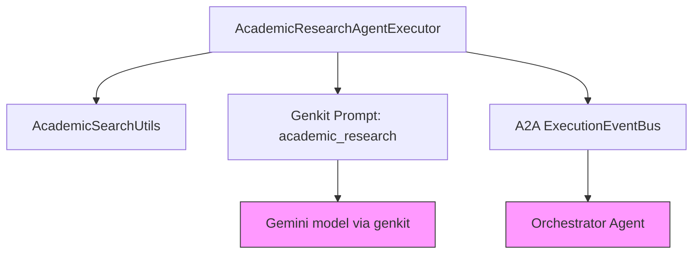

## Academic Research Agent Documentation

Short description
-----------------
The Academic Research Agent provides focused scholarly research capabilities: it searches academic databases, extracts and synthesizes findings, and returns structured research artifacts (findings, source citations, metadata) for use by the orchestrator or downstream consumers.

## 1. Component Overview

### Purpose/Responsibility

- Convert a user research request into an academic literature search and synthesis.
- Produce structured ResearchResult artifacts including findings, source citations, citation analysis, and metadata.
- Emit Task and TaskStatusUpdate events for A2A orchestration (submits progress, working, completed, failed, canceled updates).

### Scope

- Included: academic database search (via AcademicSearchUtils), result synthesis, progress updates, artifact publishing.
- Excluded: UI, long-term storage, cross-agent orchestration logic (handled by Orchestrator agent).

### System context and relationships

- Consumer: Orchestrator agent or other agents that delegate academic research tasks.
- Collaborators: `AcademicSearchUtils` (search helper), Genkit AI prompts (`academic_research`), A2A ExecutionEventBus for publishing events.

## 2. Architecture Section

### Design patterns and dependencies

- Patterns: Pipeline-style agent executor (initialize -> produce status updates -> do work -> publish artifacts), defensive parsing/fallbacks.
- Internal dependencies: `AcademicSearchUtils`, `genkit` AI prompt (via `ai.prompt('academic_research')`).
- External dependencies: `@a2a-js/sdk` (Task/TaskStatus types, server helpers), `genkit` Google AI plugin (Gemini), `uuid` for IDs, `express` for HTTP server scaffolding.

### Component structure (mermaid)



## 3. Interface Documentation

Public classes and methods

| Method/Property | Purpose | Parameters | Return Type | Usage Notes |
|---|---:|---|---:|---|
| AcademicResearchAgentExecutor.execute | Main entrypoint called by A2A framework | requestContext, eventBus | Promise<void> | Publishes Task and status updates, runs search and synthesis, publishes artifacts
| AcademicResearchAgentExecutor.cancelTask | Cancel an active task and publish cancellation status | taskId, eventBus | Promise<void> | Adds to cancelledTasks set and emits a canceled status-update
| AcademicSearchUtils.comprehensiveSearch | Search academic sources and return aggregated results | query, options | Promise<ComprehensiveSearchResult> | Not part of this component's public API but a collaborator

Events and artifacts

- Emits Task objects and TaskStatusUpdateEvent objects (states: submitted, working, completed, failed, canceled).
- On success publishes an artifact task with metadata.type = `research-findings` containing the ResearchResult.

## 4. Implementation Details

### Main responsibilities

- Validate input (extract query text from message parts).
- Use `AcademicSearchUtils` to search multiple scholarly sources (limit default 15).
- Convert search results into ResearchResult: findings (claims + evidence), source citations, synthesis metadata.
- Handle errors/fallbacks: parse Genkit output if available, otherwise generate a conservative fallback structure.

### Key algorithms and heuristics

- Confidence scoring: `calculateAcademicConfidence` (paper-based heuristic) is used to set `confidence` on findings.
- Synthesis: iterates over `searchResults.papers` to create findings and source citations; assigns credibilityScore defaults for academic sources.

### Configuration and initialization

- Requires `GEMINI_API_KEY` in environment (process exits if missing).
- Loads Genkit prompts from `genkit.ts` in the agent directory.

### Error handling

- Emits `failed` TaskStatusUpdateEvent on exceptions.
- Attempts to parse Genkit/AI responses as JSON and falls back to a default findings structure when parsing fails.

## 5. Usage Examples

Programmatic (A2A framework)

```ts
// A2A framework (agent server) invokes `execute(requestContext, eventBus)`
// Example: orchestrator delegates a task; Academic agent publishes progress and artifacts
```

## 6. Quality Attributes

- Security: No specialized auth inside agent; assumes execution environment enforces secrets and network access controls.
- Performance: Network and search-bound; the agent uses concurrency in the search helper (implementation detail in AcademicSearchUtils).
- Reliability: Uses defensive parsing and publishes `failed` status on exceptions; supports task cancellation.
- Maintainability: Small, focused code surface; helper `AcademicSearchUtils` encapsulates search providers.

## 7. Reference Information

- Key files:
  - [index.ts](../../src/agents/academic-research-agent/index.ts) — executor and orchestration events
  - [academic-search.ts](../../src/agents/academic-research-agent/academic-search.ts) — search helper
  - [genkit.ts](../../src/agents/academic-research-agent/genkit.ts) — Genkit ai instance
  - [academic_research.prompt](../../src/agents/academic-research-agent/academic_research.prompt) — Genkit prompt used by the agent

## Next steps and recommendations

- Add unit tests for the synthesis logic and parsing fallbacks (mock `AcademicSearchUtils`).
- Expose more detailed telemetry (search time, number of results, parse errors).
- Centralize default credibility and confidence thresholds in a small config module.

---
Generated from source files in `src/agents/academic-research-agent/`.
