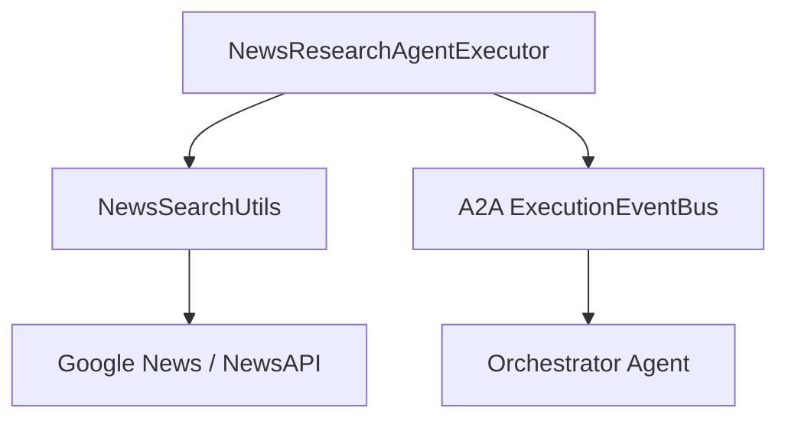

## News Research Agent Documentation

Short description
-----------------
The News Research Agent focuses on current events and media analysis. It aggregates articles from Google News, NewsAPI and other sources, computes credibility metrics, groups articles into event timelines, and produces synthesized findings for consumption by the orchestrator or downstream agents.

## 1. Component Overview

### Purpose/Responsibility

- Search and aggregate news articles and media coverage for a query.
- Compute credibility metrics and identify key events, timelines, stakeholder impacts, and media narratives.
- Publish Task and TaskStatusUpdate events and provide structured findings.

### Scope

- Included: multi-source news search, deduplication, credibility scoring, event extraction, media analysis.
- Excluded: long-term archival and external fact-checking services (outside of configured APIs).

### System Context and Relationships

- Collaborators: `NewsSearchUtils` (source aggregation), `genkit` (if used for synthesis), A2A ExecutionEventBus.
- Consumers: Orchestrator agent or other agents that request news research.

## 2. Architecture Section

### Design patterns and dependencies

- Patterns: utility-based search helper, sequence pipeline in executor, fallback tolerant network calls.
- Internal dependencies: `NewsSearchUtils` (news-search aggregation), agent executor (`index.ts`).
- External dependencies: `serpapi` (Google News scraping), `newsapi` (via HTTP), `@a2a-js/sdk` types and server helpers, `uuid`.

### Component structure (mermaid)



## 3. Interface Documentation

| Method/Property | Purpose | Parameters | Return Type | Usage Notes |
|---|---|---|---|---|
| NewsResearchAgentExecutor.execute | Main executor called by A2A framework | requestContext, eventBus | Promise<void> | Publishes Task lifecycle events and runs the news pipeline |
| NewsResearchAgentExecutor.cancelTask | Cancel a running task and emit cancellation | taskId, eventBus | Promise<void> | Publishes canceled status-update |
| NewsSearchUtils.comprehensiveNewsSearch | Aggregate search across sources | query, options | Promise<ComprehensiveNewsResult> | Returns deduplicated and sorted articles |

Events and artifacts

- Publishes TaskStatusUpdateEvent objects for states: submitted, working, completed, failed, canceled.
- Synthesized findings include `newsFindings`, `mediaAnalysis`, `contextAndAnalysis`, and `metadata`.

## 4. Implementation Details

### Key behaviors

- Cleans and normalizes the incoming query (`extractResearchQuery`).
- Queries multiple APIs with robust error handling and partial fallbacks.
- Deduplicates articles and sorts by recency and credibility.
- Synthesizes findings grouping articles into events and generating metadata.

### Heuristics and algorithms

- Deduplication by normalized title key (first 50 chars).
- Credibility scoring using a set of reputable sources and recency weighting.
- Topic grouping based on simple title keyword matching (politics, environment, economy, health, technology, sports, crime).

### Configuration

- Requires `GEMINI_API_KEY` for model-based synthesis (if used). Uses `SERPAPI_API_KEY` and `NEWSAPI_API_KEY` environment variables for search providers.

## 5. Usage Examples

```ts
// The A2A server will call `execute(requestContext, eventBus)` when a task is delegated.
```

## 6. Quality Attributes

- Security: relies on runtime environment for API keys and network controls.
- Performance: network/IO bound; deduplication and sorting are O(n log n) due to sorting.
- Reliability: Attempts partial results if some providers fail; logs and returns errors in `ComprehensiveNewsResult.errors` when providers fail.

## 7. Reference Information

- Key files:
  - [index.ts](../../src/agents/news-research-agent/index.ts) — Executor and synthesis logic
  - [news-search.ts](../../src/agents/news-research-agent/news-search.ts) — NewsSearchUtils
  - [genkit.ts](../../src/agents/news-research-agent/genkit.ts) — Genkit configuration if synthesis uses Genkit

## Next steps

- Add unit tests for deduplication, credibility scoring, and topic grouping.
- Optionally integrate a fact-checking provider and more advanced NER topic extraction.

---
Generated from source files in `src/agents/news-research-agent/`.
