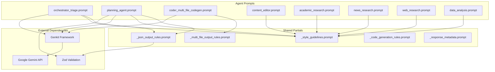
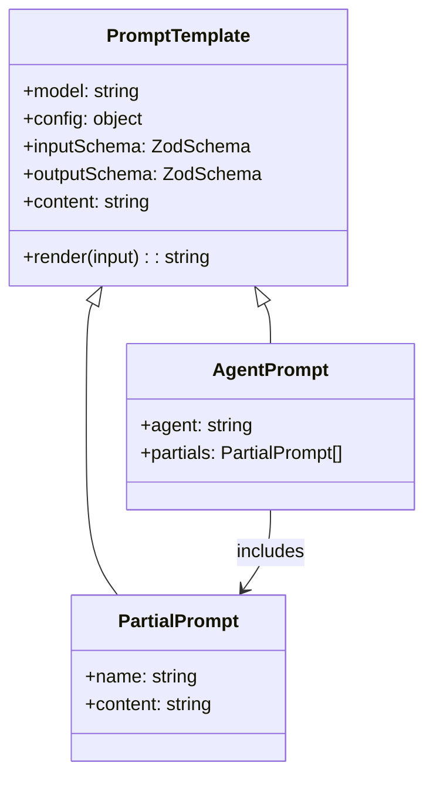

# Prompts Component Documentation

The Prompts Component provides structured template definitions for Genkit AI agents and flows, enabling consistent, schema-validated interactions with language models. It serves as the configuration layer for all AI-driven functionality in the Genkit-UI system. Prompts are defined using the Dotprompt format, which separates prompt engineering from application code for better iteration and maintenance. Note that each agent maintains its own prompt file for A2A communication, while shared prompts in this directory are used by flows.

## 1. Component Overview

### Purpose/Responsibility

- OVR-001: Define standardized prompt templates for various AI agents and flows
- OVR-002: Provide schema validation for inputs and outputs using Zod
- OVR-003: Enable modular prompt composition through partial includes
- OVR-004: Support different AI models and configurations per use case

## 2. Architecture Section

The Prompts Component follows a template-based architecture using Dotprompt, which treats prompts as code. Shared partials provide reusable rules and guidelines, while agent-specific prompts customize behavior for particular domains. Prompts are used in two contexts: shared prompts for Genkit flows, and agent-specific prompts for A2A communication protocols. The system supports Handlebars templating, schema validation with Picoschema/JSON Schema/Zod, and prompt variants for A/B testing.

- ARC-001: Design patterns: Template Method (base partials), Composition (partial includes), Strategy (model/config variations)
- ARC-002: Internal dependencies: Genkit for rendering, Zod for schema validation
- ARC-003: External dependencies: Google AI Gemini models, dotprompt format; agent-specific prompts in src/agents/*/ directories for A2A
- ARC-004: Component interactions: Used by flows and agents via Genkit's prompt loading
- ARC-005: Visual diagrams below

### Component Structure and Dependencies Diagram





## 3. Interface Documentation

### Prompt Templates Reference

| Prompt Name | Purpose | Input Schema | Output Schema | Partials Used | Model |
|-------------|---------|--------------|---------------|---------------|-------|
| _json_output_rules | JSON formatting rules | None | None | None | N/A |
| _style_guidelines | Writing style standards | None | None | None | N/A |
| _multi_file_output_rules | Multi-file code generation rules | None | None | None | N/A |
| _code_generation_rules | Code generation standards | None | None | None | N/A |
| _response_metadata | Response metadata format | None | None | None | N/A |
| orchestrator_triage | Route queries to appropriate agents | {query: string} | {delegateTo: string[], rationale: string, nextAction: string} | json_output_rules, style_guidelines | googleai/gemini-2.5-flash |
| planning_agent | Decompose queries into research plans | {query: string, constraints?: object} | {title: string, summary: string, steps: array, risks: array, notes?: string} | json_output_rules, style_guidelines | googleai/gemini-2.5-flash |
| coder_multi_file_codegen | Generate multiple code files | {specification: string, language?: string} | {files: array} | multi_file_output_rules | googleai/gemini-2.5-pro |
| content_editor | Proofread and polish content | {content: string, instructions?: string} | {editedContent: string, changes: array} | style_guidelines | googleai/gemini-2.5-flash |
| academic_research | Conduct academic research | {query: string, sources?: array} | {findings: array, sources: array, summary: string} | style_guidelines | googleai/gemini-2.5-flash |
| news_research | Research current news | {query: string, timeframe?: string} | {articles: array, summary: string, sources: array} | style_guidelines | googleai/gemini-2.5-flash |
| web_research | General web research | {query: string, depth?: string} | {results: array, summary: string, sources: array} | style_guidelines | googleai/gemini-2.5-flash |
| data_analysis | Analyze data and generate insights | {data: object, analysisType: string} | {insights: array, visualizations: array, recommendations: array} | style_guidelines | googleai/gemini-2.5-flash |

### Schema Formats

Prompts support multiple schema definition formats:

- **Picoschema**: Compact YAML-optimized format supporting:
  - Scalar types: `string`, `integer`, `number`, `boolean`, `any`
  - Optional fields: `field?: type`
  - Arrays: `field(array): type` or `field(array, description): type`
  - Objects: `field(object): { nested: type }`
  - Enums: `field(enum): [VALUE1, VALUE2]`
  - Wildcards: `(*): type` for additional properties
  - Example: `tags(array, relevant tags): string`
- **JSON Schema**: Full JSON Schema for complex validations
- **Code References**: Reference Zod schemas defined in application code using `schema: SchemaName`

### Template Features

- **Handlebars Templating**: `{{variable}}`, `{{#if condition}}...{{/if}}`, `{{#each items}}...{{/each}}`
- **Multi-message Prompts**: `{{role "system"}}...{{role "user"}}...`
- **Partials**: Reusable templates with `{{>partialName args...}}`
- **Multi-modal**: `{{media url=imageUrl}}` for images (supports https/data URLs)
- **Custom Helpers**: User-defined functions registered with `ai.defineHelper()`
- **Tool Calling**: Enable tools via `tools: [toolName]` in front matter

## 4. Implementation Details

- IMP-001: Main implementation uses Dotprompt format with YAML front matter and Handlebars templating
- IMP-002: Front matter includes model selection, configuration, input/output schemas
- IMP-003: Schema validation supports Picoschema, JSON Schema, and code references
- IMP-004: Partials enable DRY principle with files prefixed with underscore
- IMP-005: Prompt variants support A/B testing with `[name].[variant].prompt` files
- IMP-006: Multi-modal prompts support images via {{media}} helper
- IMP-007: Directory structure: Default `prompts/` directory auto-loaded by Genkit
- IMP-008: Version control: Prompt files should be committed for change tracking
- IMP-009: Developer UI integration: Prompts can be created/exported from Genkit UI

### Directory Structure

```bash
src/
├── prompts/                    # Default prompt directory
│   ├── _json_output_rules.prompt    # Shared partials (underscore prefix)
│   ├── _style_guidelines.prompt
│   ├── orchestrator_triage.prompt   # Agent-specific prompts
│   ├── planning_agent.prompt
│   └── planning_agent.experimental.prompt  # Variant for A/B testing
├── agents/                     # Agent-specific prompts for A2A
│   └── orchestrator-agent/
│       └── orchestrator.prompt
```

### Advanced Features

#### Tool Calling
Prompts can enable tool calling by specifying tools in the front matter:

```yaml
---
model: googleai/gemini-2.5-pro
tools: [search_flights, search_hotels]
input:
  schema:
    destination: string
---
Plan a trip to {{destination}}, using available tools.
```

#### Custom Helpers
Define custom Handlebars helpers for data processing:

```typescript
ai.defineHelper('shout', (text: string) => text.toUpperCase());
```

Used in prompts: `HELLO, {{shout name}}!!!`

#### Prompt Variants
Create A/B test variants with `[name].[variant].prompt` files:

```typescript
const variantPrompt = ai.prompt('planning_agent', { variant: 'experimental' });
```

#### Streaming Support
Prompts support streaming responses:

```typescript
const { response, stream } = await planningPrompt.stream({ query });
for await (const chunk of stream) {
  console.log(chunk.text);
}
```

## 5. Usage Examples

### Basic Usage

```typescript
// Load and use a prompt in a Genkit flow
import { ai } from '../config';

const planningFlow = ai.defineFlow({
  name: 'planning',
  inputSchema: z.string().describe('Query to plan'),
  outputSchema: z.object({ /* output schema */ }),
}, async (query) => {
  const planningPrompt = ai.prompt('planning_agent');
  const { output } = await planningPrompt({ query });
  return output;
});
```

### Advanced Usage with Variants

```typescript
// Use a prompt variant for A/B testing
const promptVariant = ai.prompt('orchestrator_triage', { variant: 'experimental' });
const result = await promptVariant({ query: 'Build a website' });
```

### Multi-modal Prompt

```dotprompt
---
model: googleai/gemini-2.5-flash
input:
  schema:
    imageUrl: string
---
Describe this image: {{media url=imageUrl}}
```

```typescript
const multimodalPrompt = ai.prompt('image_description');
const { text } = await multimodalPrompt({ imageUrl: 'https://example.com/image.jpg' });
```

### Advanced Usage

```typescript
// Custom prompt with partial composition
const customPrompt = `
{{role "system"}}
{{>json_output_rules}}
{{>style_guidelines}}
You are a specialist in {{domain}}.

{{role "user"}}
Analyze: {{query}}
`;

const result = await ai.generate({
  prompt: customPrompt,
  input: { domain: 'finance', query: 'market trends' }
});
```

- USE-001: Load prompts using Genkit's import system
- USE-002: Compose custom prompts using partial includes
- USE-003: Validate inputs/outputs with Zod schemas

## 6. Quality Attributes

- QUA-001: Security: Input validation prevents injection; no sensitive data in prompts
- QUA-002: Performance: Optimized token usage through concise prompts; model selection impacts latency/cost; streaming reduces perceived latency; caching of compiled templates
- QUA-003: Reliability: Schema validation ensures consistent outputs; error handling in partials
- QUA-004: Maintainability: Modular partials; clear separation of concerns
- QUA-005: Extensibility: Easy to add new prompts; partial reuse for consistency

## 7. Reference Information

- REF-001: Dependencies: Genkit ^1.20.0, Zod ^4.1.11, Google AI SDK
- REF-002: Configuration: Model configs in front matter; environment variables for API keys
- REF-003: Testing:
  - Unit tests: Mock AI responses to test prompt rendering and schema validation
  - Integration tests: Test full prompt execution with actual models (use test API keys)
  - Schema validation: Test input/output schemas with various data types
  - Variant testing: Compare performance metrics between prompt variants
  - Error handling: Test malformed inputs and API failures
- REF-004: Troubleshooting:
  - Schema mismatches: Verify Picoschema syntax and field types
  - Partial not found: Check underscore prefix and file location
  - Model errors: Confirm API keys and model availability
  - Template errors: Validate Handlebars syntax and variable names
  - Streaming issues: Ensure model supports streaming
  - Tool calling: Verify tools are registered with Genkit instance
- REF-005: Related docs: [Genkit Dotprompt documentation](https://firebase.google.com/docs/genkit/dotprompt), agent documentation, individual agent READMEs for A2A prompt details
- REF-006: Change history: Initial version with 13 prompts; added partial system for reusability